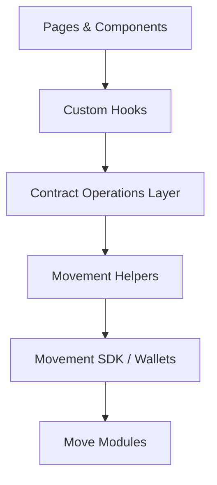

# Front-end (Next.js)

Feature-rich Next.js 14 app that surfaces the Rather Strategy contracts: marketplace listings, strategy treasury metrics, liquidity pool stats, and gated admin utilities.

## Highlights

- App Router build with Chakra UI theming and custom color system.
- Network-aware hooks switch between devnet, testnet, and mainnet configurations.
- Wallet UX that supports Movement-compatible browser wallets (Nightly).
- Admin portal guarded so only the deployer address sees the navigation and page.
- Marketplace cards and holdings automatically render NFT art from on-chain token URIs.

## Architecture



## Directory map

```
src/
├── app/                 # App Router pages (landing, marketplace, liquidity, strategy, admin)
├── components/          # UI building blocks and wallet/network providers
├── constants/           # Contract address/name helpers
├── hooks/               # Reusable data hooks (wallet, holdings, network)
├── lib/                 # Movement contract operations + network utilities
└── utils/               # Formatting helpers and explorer link builders
```

## Environment variables

The app reads env vars prefixed with `NEXT_PUBLIC_`. Create `.env` and export at least:

```env
NEXT_PUBLIC_MODULE_ADDRESS=<address where Move modules are deployed>
```

## Scripts

```bash
npm run dev      # Start Next.js in development mode
npm run build    # Production build
npm run start    # Serve the production build locally
npm run lint     # ESLint check
```

## Wallet & admin behaviour

- The navbar displays the **Admin** link only when the connected wallet matches the module deployer address; the page itself repeats the check and shows a restricted message otherwise.
- Users can connect via the `ConnectWallet` component which integrates with Nightly wallet.

## Data flow

- Read-only queries use view functions via helpers in `lib/movement-client.ts`.
- Contract write operations are defined in `lib/<domain>/operations.ts` and invoked from components via React hooks.
- NFT preview images are fetched through the `TokenImage` component which resolves token URIs and renders via `next/image`.

## Development workflow

1. Ensure the `.env` matches the address of the currently deployed Move modules.
2. Start `npm run dev` and browse the landing page at `http://localhost:3000`.
3. Connect a wallet and exercise the dashboard, marketplace, liquidity, and admin flows.

Refer back to the [root README](../README.md) for full-stack setup instructions and contract deployment steps.
